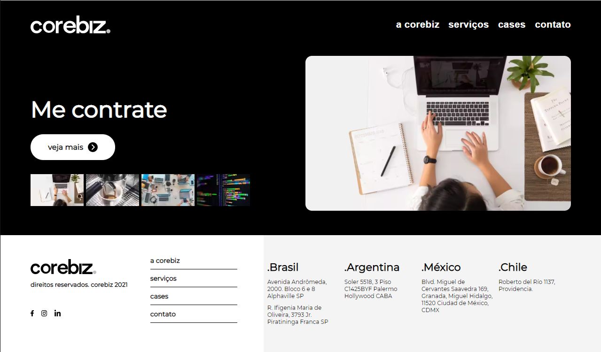
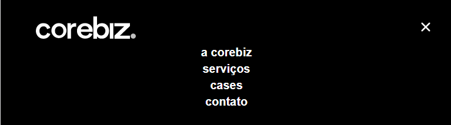
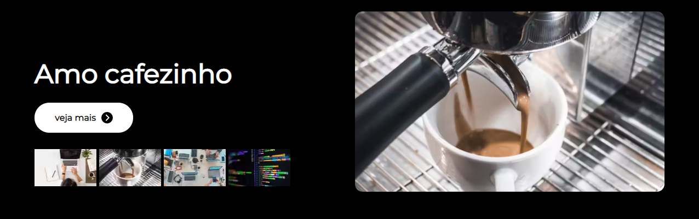
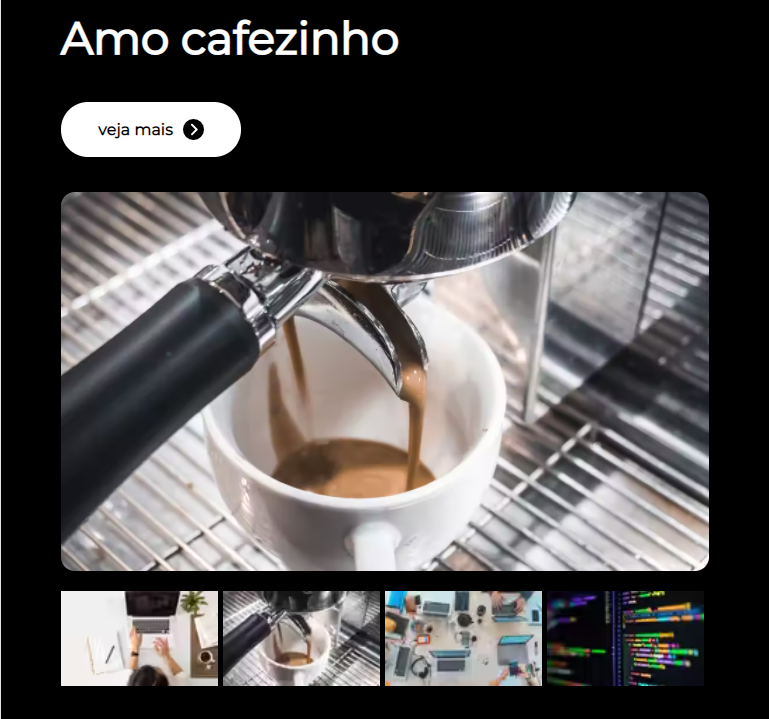
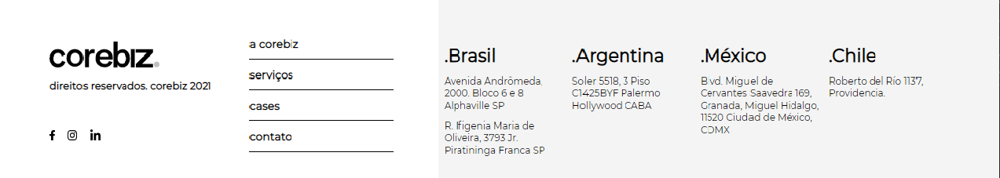
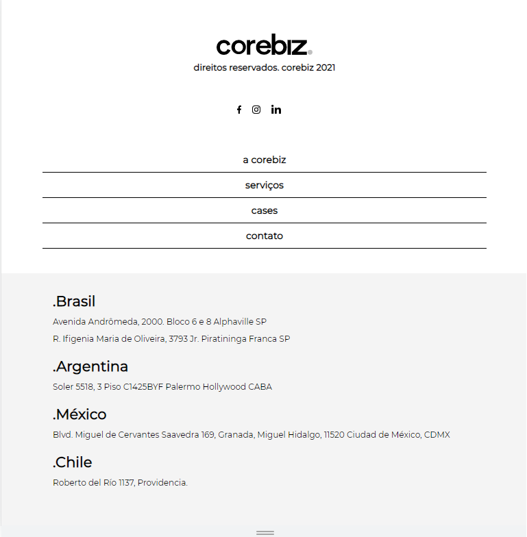

<div align="center">
  <h1>GoBeyond Layout</h1>

  <a href="https://www.corebiz.ag/pt/">
    
  </a>

  <p>Desenvolver um layout proposto pelo time da Corebiz para mostrar os conhecimentos adiquirios durante o GoBetond.</p>

  <br />

[**Layout**](https://xd.adobe.com/view/e100320d-9539-4cd9-9146-e27f75204e69-b453/specs/) |
[**Documentação**](https://whimsical.com/en-corebiz-go-beyond-2021-final-challenge-5gCdWPXuY3Sj12NMmnydZW)|
[**link do app**](https://desafio-final-gobeyond-delta.vercel.app/)

  <br />
</div>

<h4 align="center"> 
	🖥️  GoBeyond 🚀 Finalizado😀😀  🖥️

Desde já agradeço a todo o time da `Corebiz` por ter me proporcionar esse enorme conhecimento, essas ultimas semanas pude ver na pratica como é ser desafiado a ir além, em um nivel totalmente novo de conhecimento o que me fizeram amar ainda mais a tecnologia, muito obrigado a todos vocês pela dedicação e carinho que tiveram por mim, e tambem quero agradecer os novos amigos desenvolvedores de conseguir nessa nova etapa da minha carreira. Seria um sonho realizado poder trabalhar no time de vocês #Corebiz forever 💖💖💖💖

</h4>

<h1 align="center">
  
</h1>
### Features

- [x] Home Page com imagens
- [x] Header
- [x] Conteúdo principal
  - [x] Consumir a API `https://jsonplaceholder.typicode.com`
  - [x] Na coluna da direita, uma grande imagem dinâmica.
  - [x] Na coluna da esquerda, um título dinâmico seguido de um botão veja mais que redireciona para o site `Corebiz`.
  - [x] Uma lista de pequenas imagens dinâmicas que mudam o título atual e a imagem grande quando você clica nela.
- [x] Rodapé

<!--ts-->

- [Sobre](#Sobre)
- [Instalação](#instalacao)
- [Componentes](#componentes)
  - [Header](#header)
  - [Main](#main)
    - [PostImg](#postimg)
    - [Title](#title)
  - [Footer](#footer)
- [Services](#services)
- [Tecnologias](#tecnologias)
<!--te-->

## Sobre

O seguinte projeto consiste em desenvolver um layout proposto pelo time da `Corebiz`, para demonstrarmos os conhecimentos adquiridos no treinamento GoBeyond. O layout consiste em uma versão **_web_** e uma **_mobile_**, com imagens e textos dinamicos consumidos de um **_api_**.
Para visualizar o layout, clique [**aqui**](https://xd.adobe.com/view/e100320d-9539-4cd9-9146-e27f75204e69-b453/specs/)

## Instalação

Nesta etapa você pode instalar o projeto em seu computador 🖥️ para visualizar o seu funcionamento.

Siga os passos abaixo para instalar o projeto:

```
#Clone o repositório
$ git clone https://github.com/Everton-Afonso/DesafioFinalGobeyond.git
```

```
# Instale as dependencias
$ npm i ou yarn
```

```
# Para rodar o projeto
$ npm start ou yarn start
```

## Componentes

### Header

O componente Header é um menu responsivo na horizontal que possui o logo da `Corebiz` a esquerda e uma lista de links a direita, ao clicar em um dos seguintes links **_a corebiz serviços cases contato_** você e redirecionado para uma pagina do site da `Corebiz`. O menu é redimensionando para a versão mobile quando o dispositivo posuir uma tela a baixo de 780px.

Versão Web:

<h1 align="center">
  
</h1>

Versão Mobile:

<h1 align="center">
  
</h1>

<h1 align="center">
  
</h1>

estrutura do componente:

```
import React, { useState } from "react";

import "./styles.css";

function Header() {
  const [isMobile, setIsMobile] = useState(false);

  return (
    <header className="container-header">
      

      <nav className="container-links">
        <ul
          className={isMobile ? "nav-links-mobile" : "nav-links"}
          onClick={() => setIsMobile(false)}
        >
          <li>
            <a
              href="https://www.corebiz.ag/pt/about/"
              target="_blank"
              rel="noreferrer"
            >
              a corebiz
            </a>
          </li>
          <li>
            <a
              href="https://www.corebiz.ag/pt/#framework-title"
              target="_blank"
              rel="noreferrer"
            >
              serviços
            </a>
          </li>
          <li>
            <a
              href="https://www.corebiz.ag/pt/cases/"
              target="_blank"
              rel="noreferrer"
            >
              cases
            </a>
          </li>
          <li>
            <a
              href="https://www.corebiz.ag/pt/contato/"
              target="_blank"
              rel="noreferrer"
            >
              contato
            </a>
          </li>
        </ul>

        <button
          className="mobile-menu-icon"
          onClick={() => setIsMobile(!isMobile)}
        >
          
        </button>
      </nav>
    </header>
  );
}

export default Header;

```

### Main

O componente Main é responsável por renderizar os dados obtidos da API, que por sua vez possui dois outro componentes **_PostImg e Title_**. O componente Main possui duas colunas, a da esquerda renderizar o componente **_Title_**, um button que ao ser clicado leva para o home do site da `Corebiz` e um mini-model que são exibidas as miniaturas das imagens retornadas da API. A culuna da direita renderizar o componente **_PostImg_** que exibe as imagens retornadas da API. O mini-model por sua vez ao ser clicado altera o estado do componente **_Title_** e do componente **_PostImg_** alterando seus conteudos. A main é redimensionando para a versão mobile quando o dispositivo posuir uma tela a baixo de 780px.

Versão Web:

<h1 align="center">
  
</h1>

Versão Mobile:

<h1 align="center">
  
</h1>

estrutura do componente:

```
import React, { useEffect, useState } from "react";

import api from "../../services/api";
import PostImg from "../PostImg";
import Title from "../Title";

import "./styles.css";

function Main() {
  const [album, setAlbum] = useState([]);
  const [post, setPost] = useState(0);

  useEffect(() => {
    api
      .get("Everton-Afonso/db/album")
      .then((response) => setAlbum(response.data))
      .catch((error) => {
        alert(`Ops! ocorreu um erro: ${error}`);
      });
  }, []);

  return (
    <main className="main-conteiner">
      <section className="main-content">
        <section className="main-text">
          {<Title title={album[post]?.title} />}
          <a
            href="https://www.corebiz.ag/pt/"
            target="_blank"
            rel="noreferrer"
            alt="veja mais"
          >
            veja mais
            
          </a>
        </section>

        <section className="model">
          {<PostImg url={album[post]?.url} />}
        </section>

        <section className="model-mini">
          <div>
            {album.map((itens, index) => (
               setPost(index)}
                src={itens.thumbnailUrl}
                alt="imagens do mini model"
              />
            ))}
          </div>
        </section>
      </section>
    </main>
  );
}

export default Main;
```

#### Title

O componente Title recebe uma props do componente main para saber qual **titulo** deve ser renderizada quando o mini-model for clicado.

estrutura do componente:

```
import React from "react";

import "./styles.css";

function Title({ title }) {
  return (
    <>
      <h2 className="main-title">{title}</h2>
    </>
  );
}

export default Title;
```

#### PostImg

O componente PostImg recebe uma props do componente main para saber qual **imagem** deve ser renderizada quando o mini-model for clicado.

estrutura do componente:

```
import React from "react";

import "./styles.css";

function PostImg({ url }) {
  return (
    <div className="post-img">
      
    </div>
  );
}

export default PostImg;
```

### Footer

O componente Footer consiste no rodapé da pagina, o mesmo possui seis culunas que conten as seguintes informações: o logo da `Corebiz`, uma menu de links que redirecionado para uma pagina do site da `Corebiz`, e os paizes onde estão localizados suas escritorios. O fooder é redimensionando para a versão mobile quando o dispositivo posuir uma tela a baixo de 780px e todo o seu conteudo passa a ser exibido na vertical.

Versão Web:

<h1 align="center">
  
</h1>

Versão Mobile:

<h1 align="center">
  
</h1>

### Services

A pasta Services contem um arquivo **_js_** que trás as informações da API `https://my-json-server.typicode.com` utilizando o **_axios_** para fazer uma requisição dos dados.

estrutura do Services:

```
import axios from "axios";

const api = axios.create({
  baseURL: "https://my-json-server.typicode.com"
});

export default api;
```

### Tecnologias

Esse projeto foi desenvolvido com as seguintes tecnologias:

- HTML
- CSS
- JavaScript
- ReactJS
- Axios